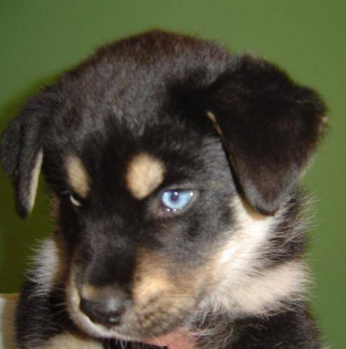

# CNN Transfer Learning

The principle is easy: optimize and accelerate the learning of a model by training specific layers,
transfer them to a deeper model and iterate.

This is relevant when the compute capacity gets insufficient compared to the needs.
Cloud GPUS are good but at some point beyond the budget...
This is also a good opportunity to better understand the building and training of models.

## Task list
- [X] cleanup the readme
- [X] display nice pics of cats/dogs in the readme
- [X] train these models over a decent number of epochs
- [ ] reduce variance with relevant regularisation
- [ ] push a model with 2-3 conv blocks over 90% val accuracy
- [ ] add a predict function for one picture after the training
- [ ] display last used learning rate

## Context
Let's train a dog and cat classifier over 10000 pictures (5000 dogs, 5000 cats).
8000 are used for training (+ data augmentation) and 2000 for testing.
Pictures from the [CIFAR10 datasets](https://www.cs.toronto.edu/~kriz/cifar.html)

Yes my friends, a big bunch of cute cat and dog pictures like this:

## Data augmentation
10000 pictures is actually not a lot for computer vision. For that reason, the existing data is multiplicated by a range of smart techniques:
- mirroring pictures left-right (effectively doubling the dataset size)
- random cropping/zooming
- adjusting the colors

The data augmentation generator produces variations out of each original picture.
This leads to a wider range of pictures and reduces overfitting.
The test dataset is also augmented using the same technique.

In practice, with a standard batch_size of 32, the data generator produces new variations out of each original picture, 32 at once.
Increasing this batch_size normally leads to a faster performance up to a certain limit.
On my CPU and RAM, it was faster with a batch_size of 16 than 32.
Overall, it took 25 minutes per epoch (1 pass through the data).
For that reason, I saved the network parameters weights to conveniently load them again and continue the training later.

That happened to be convenient to transfer weights into new versions of the network.

## Building the model
Here are 2 simple models

    classifier_1 = Sequential()
    classifier_1.add(Convolution2D(32, kernel_size=(3,3), padding='same', input_shape=(64,64,3), activation='relu'))
    classifier_1.add(MaxPooling2D(pool_size=(2,2)))
    classifier_1.add(Flatten())
    classifier_1.add(Dense(128, activation='relu'))
    classifier_1.add(Dense(1, activation='sigmoid'))

    classifier_2 = Sequential()
    classifier_2.add(Convolution2D(32, kernel_size=(3,3), padding='same', input_shape=(64,64,3), activation='relu'))
    classifier_2.add(MaxPooling2D(pool_size=(2,2)))
    classifier_2.add(Convolution2D(32, kernel_size=(3,3), padding='same', activation='relu'))
    classifier_2.add(MaxPooling2D(pool_size=(2,2)))
    classifier_2.add(Flatten())
    classifier_2.add(Dense(128, activation='relu'))
    classifier_2.add(Dense(1, activation='sigmoid'))

## Remark about the neural network and trainable parameters    
Who has taken a Computer Vision course or made a few tutorials on the topic, knows that pictures means a lot of processing. 64x64 format is quite small for pictures, and it has already 12228 dimensions. Plug directly a standard neural network, say 1000 nodes, and you have 12M parameters.

That's where convolution networks come handy. They contain in comparison very few parameters and, coupled with a typical max pooling, encode important features from the picture while significantly reducing the size of the resulting feature vector.

We can see this in these 2 summaries:

    classifier_1.summary()

    Layer (type)                 Output Shape              Param #   
    =================================================================
    conv2d_1 (Conv2D)            (None, 64, 64, 32)        896       
    max_pooling2d_1 (MaxPooling2 (None, 32, 32, 32)        0         
    flatten_1 (Flatten)          (None, 32768)             0         
    dense_1 (Dense)              (None, 128)               4194432   
    dense_2 (Dense)              (None, 1)                 129       
    =================================================================
    Total params: 4,195,457
    Trainable params: 4,195,457
    Non-trainable params: 0
    _________________________________________________________________

The second network has one more convolution block (conv2d + max pooling)

    classifier_2.summary()

    Layer (type)                 Output Shape              Param #   
    =================================================================
    conv2d_2 (Conv2D)            (None, 64, 64, 32)        896       
    max_pooling2d_2 (MaxPooling2 (None, 32, 32, 32)        0         
    conv2d_3 (Conv2D)            (None, 32, 32, 32)        9248      
    max_pooling2d_3 (MaxPooling2 (None, 16, 16, 32)        0         
    flatten_2 (Flatten)          (None, 8192)              0         
    dense_3 (Dense)              (None, 128)               1048704   
    dense_4 (Dense)              (None, 1)                 129       
    =================================================================
    Total params: 1,058,977
    Trainable params: 1,058,977
    Non-trainable params: 0
    _________________________________________________________________

The first network, which is quite small, has already 4 millions parameters.
The second one, although deeper, has 1 million, 4 times less!
Intuitively we would have expected more parameters on a deeper network, wouldn't we?
In practice, each convolution block compresses the data dimension.
The resulting feature dimension is 32768 in the first network, and 8192 in the second => 4 times less parameters.

Most of the parameters are actually between this resulting feature vector and the begining of the standard neural network (dense_n in the table).
The flattening itself transforms the resulting matrix into a flat vector, keeping the same dimention.
The number of parameters between this feature vector and the first fully connected layer is vector dimension x number of nodes (128) + number of biases (128 again).

So overall, when building a CNN, adding more convolutions blocks actually means less trainable parameters.

## Model fitting and transfer
Starting with the smaller network, I trained it and obtained a 79% accuracy rate after a few epochs.
Fair enough without a GPU, only a few epochs and not so much data.

Then I added a new Convolution2D + MaxPool block and transferred as many weights as possible into the new one.
A full copy from a model to another identical model is actually quite easy.

Storing the trained weights of a classifier model into a file is useful to reload it later:

    classifier_2.save_weights("classifier2_tmp.h5")
    
Loading these weights again:

    classifier_2.load_weights("classifier2_tmp.h5")

### Limits of weight transfer
We can transfer the whole set of weights from the file only if the encoded model and the new model have exactly the same structure and dimensions.
If not, we can still transfer weight layer by layer.

First, a model with exactly the same structure has to be created and weights are loaded into it.
Either like this:
Or more conveniently by saving and loading the whole model into and from the h5 file.

    classifier.save("classifier_model_tmp.h5")
    classifier_new.load("classifier_model_tmp.h5")

Then weights can then be transferred layer per layer, as long as they have the same type and dimension.

    classifier_2.layers[0].set_weights(classifier_1.layers[0].get_weights())

In this case, only the first layer could be transferred, due to some limits.
- Max Pooling has no trainable parameters, so nothing to transfer
- Flattening just flattens a rank 2 matrix into a flat vector, of course no trainable parameters.
- After the new convolution block in the new model, the feature vector size reduced from 32K to 8K. Dimensions differ, this layer cannot be transferred
- It does not make any sense to transfer the last layer as it is based on completely different layers.

At the end, only the first layer could be transferred, **but it had a positive effect.**

I checked it by fitting the second deeper model over several epochs.
Once with weight transfer, once without.
- After weights transfer, the model reached quickly 82% validation accuracy and stagnated at this level
- without transfer, the model reached quickly 79% validation accuracy and stagnated there

## Conclusion
It's quite interesting to see that training a very small network and just transferring its first convolution weights immediately increases the performance of 3% of the second network. And this advantage lasts over at least a few training epochs.
I believe that this small advantage also transfers on bigger models and can save quite some computing time.
Pushing this a bit more, training longer the first model before transferring the weights could result in a better accuracy.

# Further progress
I trained a few models and of course used the recommended Adam optimizer. It speeds up the convergence at first and then slows down later not to overshoot while oscillating around an optimum.

I wanted to check the value of the learning rate over the last epoch. I got actually crazy looking for this simple information.
It is surpringly hard to find. Basically, I did not find it. Most methods I found basically were returning only the INITIAL learning rate, you know, before decay and momentum. It looks like it's obvious I should have gotten it simply by calculating it. OK...

Well, looking for this futile information, I have also been digging into any possible forum and Keras documentation, the Keras object model, layer and optimizer variables.
I could only get the INITIAL learning rate, before 
Maybe I'll find it once I won't care about it anymore.
Definitively useful.

### Some findings:
**Reduce LR on plateau**:

    callback_list = []
    
    # Reduce LR on plateau
    reduce_lr = ReduceLROnPlateau(monitor='val_loss', factor=0.2,
                          patience=5, min_lr=1.e-5)
    callback_list.append(reduce_lr)
    model.compile('adam', loss='binary_crossentropy', metrics=metric_list)

    history = model.fit_generator(training_set,
                         steps_per_epoch=train_size,
                         epochs=initial_epoch + new_epochs,
                         validation_data=test_set,
                         validation_steps=test_size,
                         initial_epoch=initial_epoch,
                         callbacks=callback_list)

This triggers a 80% reduction of the learning rate once a plateau has been reached, after a default "patience" of 5 epochs.
According to the documentation and a few blogs, most models benefit from it. The obvious reason is that at some point, the model is at "learning rate" distance from a mimimum. Hence, it keeps jumping too far to the other side of that target.
Then making smaller steps enables getting closer to it.

A simple way to dig into the model object:

    vars(model)
    vars(model.optimizer)
    vars(model.layers)

This simple approach enables to understand the internal structure of the Keras object model and look where specific data is located.
The initial learning rate is for instance located **here**:

    model.optimizer.lr

So damn simple...
